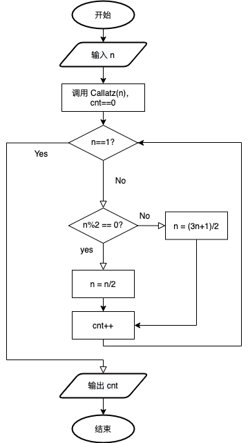

# PAT (Basic Level) Practice - 1001 害死人不偿命的(3n+1)猜想

## 题目

卡拉兹（Callatz）猜想：

对任何一个正整数 $n$，如果它是偶数，那么把它砍掉一半；如果它是奇数，那么把 $(3n+1)$ 砍掉一半。这样一直反复砍下去，最后一定在某一步得到 $n=1$。卡拉兹在 1950 年的世界数学家大会上公布了这个猜想，传说当时耶鲁大学师生齐动员，拼命想证明这个貌似很傻很天真的命题，结果闹得学生们无心学业，一心只证 $(3 n+1)$，以至于有人说这是一个阴谋，卡拉兹是在蓄意延缓美国数学界教学与科研的进展……

我们今天的题目不是证明卡拉兹猜想，而是对给定的任一不超过 1000 的正整数 $n​$，简单地数一下，需要多少步（砍几下）才能得到 $n=1​$？

### 输入格式

每个测试输入包含 1 个测试用例，即给出正整数 *n* 的值。

### 输出格式

输出从 $n​$ 计算到 1 需要的步数。

### 输入样例

```in
3
```

### 输出样例

```out
5
```

## 解题思路

卡拉兹猜想作为 Basic Level 的第一道题，思路很简单，编写 `Callatz` 函数进行实现。函数以 `n` 为输入，整型变量 `cnt` 作为输出，利用 `if` 判断奇偶，通过循环计算从 $n$ 到 1 所需要的步数，存到`cnt`变量中，具体代码如下：



## 代码

### C (gcc 6.5.0)

```C
#include <stdio.h>

int Callatz(int n);

int main(int argc, char *argv[]) {
	int n;
	scanf("%d", &n);
	printf("%d\n", Callatz(n));
	
	return 0;
}

int Callatz(int n)
{
	int cnt = 0;
	while(n != 1) {
		if(n%2 == 0) {
			n /= 2;
		}
		else {
			n = (n*3+1) / 2;
		}
		cnt++;
	}
    return cnt;
}


```

### C++(g++ 6.5.0)

```C++
#include<iostream>
using namespace std;

int Callatz(int n);

int main() 
{
    int n;
    cin>>n;
    cout<<Callatz(n);
    return 0;
}

int Callatz(int n)
{
    int cnt = 0;
    while(n != 1) {
        if (n%2 == 0) {
            n /= 2;
        }
        else {
            n = (n*3+1) / 2;
        }
        cnt++;
    }
    return cnt;
}
```

### Python (python3 3.7.7)

```python
def Callatz(n):
    cnt = 0;
    while n!=1:
        if n%2==0:
            n /= 2
        else:
            n = (n*3+1) / 2
        cnt = cnt+1
    return cnt
        
n = eval(input())
print(Callatz(n))
```